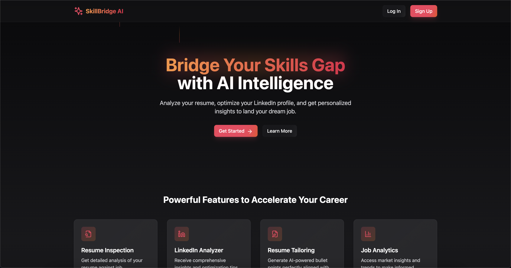
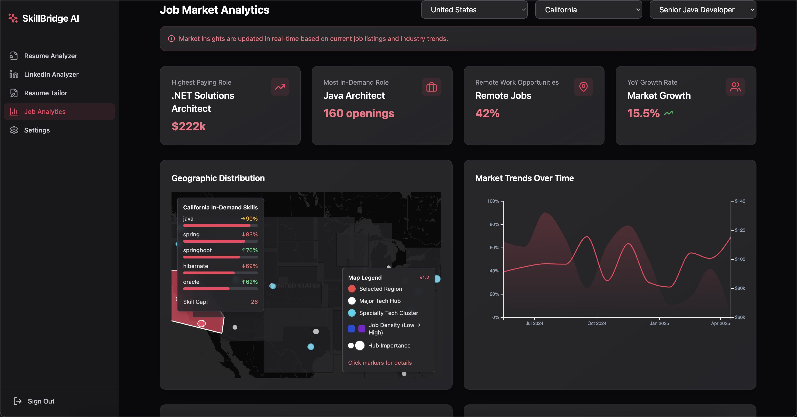
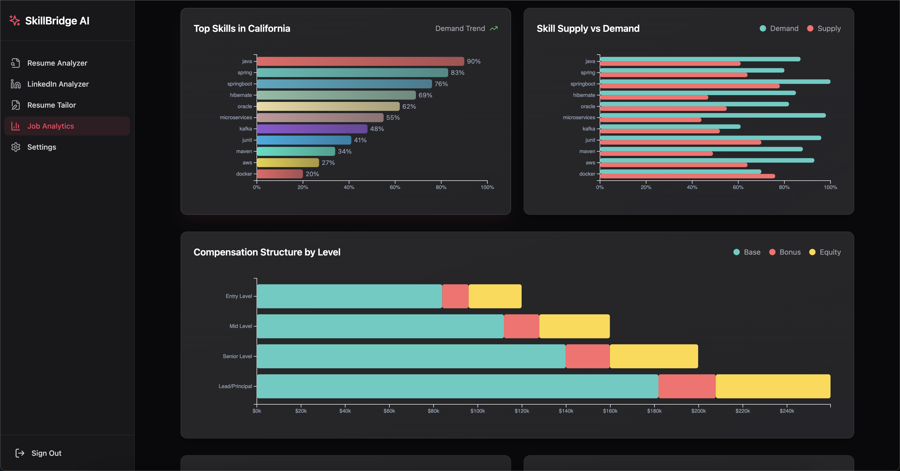
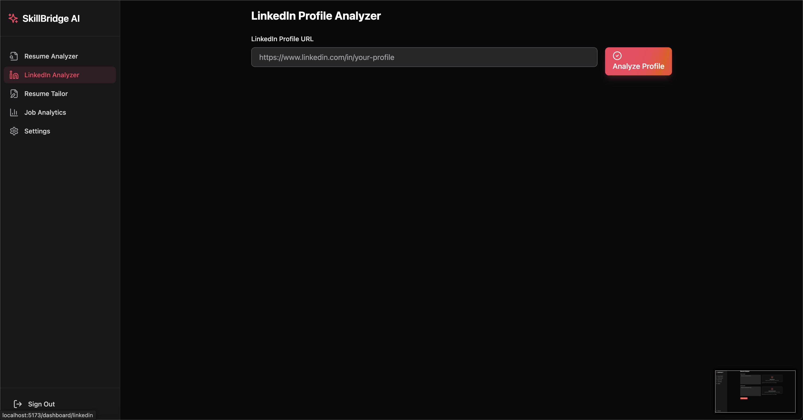
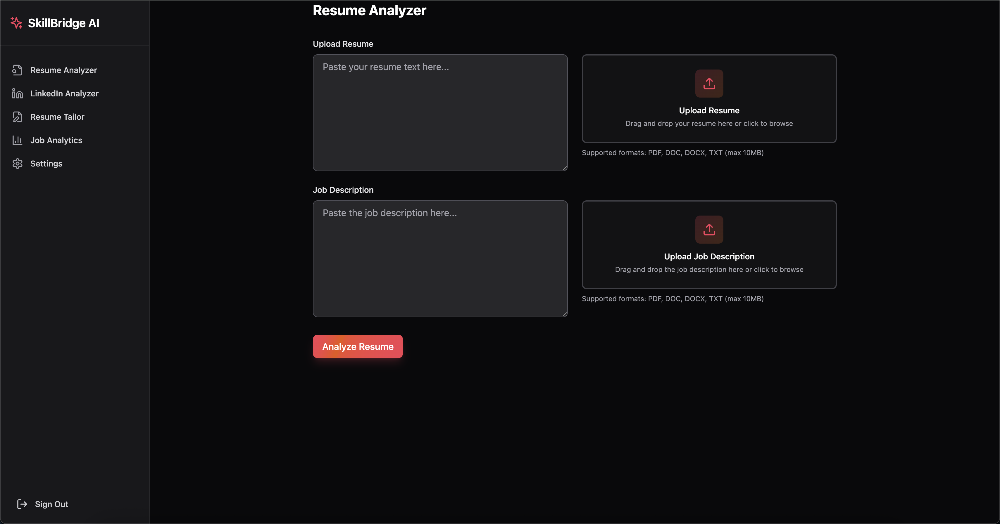
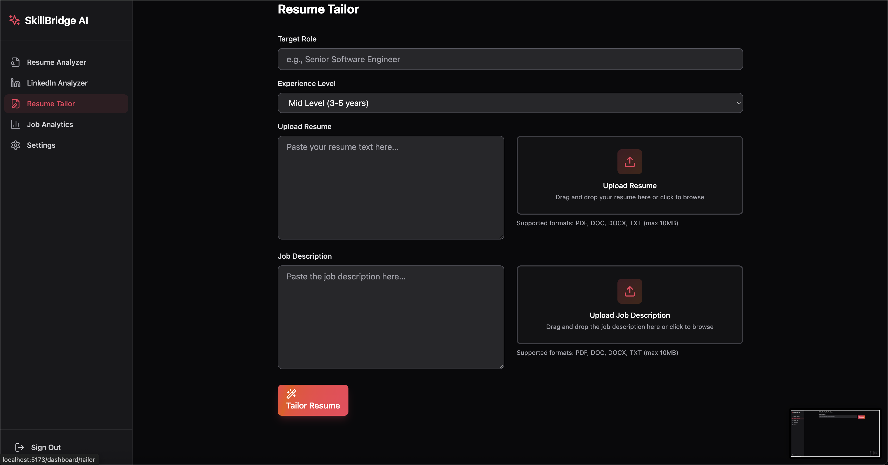

# SkillBridge AI

A modern web application built to help users enhance their skills, connect with opportunities, and accelerate their career growth through AI-powered insights.

## Introduction

SkillBridge AI is an intelligent career development platform designed to bridge the gap between your current skills and your career aspirations. By leveraging advanced AI models and data visualization techniques, SkillBridge offers personalized insights and recommendations that help users optimize their professional profiles, identify skill gaps, and discover relevant opportunities in the job market.

The platform analyzes various inputs including LinkedIn profiles, resumes, and job descriptions to provide actionable intelligence that gives users a competitive edge in today's rapidly evolving job market. Whether you're looking to transition careers, climb the corporate ladder, or simply keep your skills relevant, SkillBridge AI provides the tools and insights you need to succeed.

## Overview

SkillBridge AI is a React-based web application that provides users with a personalized dashboard to track their skill development, connect with opportunities, and visualize their progress through interactive data visualizations.

### Key Capabilities

- **Profile Analysis**: Advanced AI-powered analysis of LinkedIn profiles and resumes to identify strengths, weaknesses, and improvement opportunities
- **Skill Mapping**: Visual representation of your skill ecosystem and how it relates to market demands
- **Job Market Intelligence**: Data-driven insights about job market trends, skill demands, and career opportunities
- **Personalized Recommendations**: Custom-tailored suggestions for skill development, learning resources, and job applications
- **Resume Optimization**: AI-assisted resume tailoring for specific job descriptions to maximize interview chances

### Technical Architecture

The application is built on a modern tech stack with React and TypeScript on the frontend, Supabase for backend services, and integration with various AI services and APIs:

1. **Frontend Layer**: React application with TypeScript, Tailwind CSS for styling, and Framer Motion for animations
2. **Authentication Layer**: Supabase Auth for secure user management with custom AuthContext provider
3. **Data Layer**: PostgreSQL database (via Supabase) with real-time capabilities and row-level security
4. **AI Integration Layer**: OpenRouter for access to Gemini AI models, with custom prompt engineering
5. **Analytics Layer**: D3.js and custom visualization components for data presentation
6. **API Integration Layer**: Multiple third-party APIs for job market data, company information, and skill taxonomies

### Target Audience

- **Job Seekers**: Professionals looking to optimize their resume and skills for specific job opportunities
- **Career Changers**: Individuals planning career transitions who need to identify transferable skills
- **Professionals**: Established workers wanting to stay current with industry skill demands
- **HR & Recruiters**: Talent professionals seeking to match candidates with position requirements
- **Learning & Development**: L&D teams building targeted upskilling programs

## Features

### User Authentication and Profile Management

- Secure user registration and login powered by Supabase Auth
- Profile customization with skill tagging and interest tracking
- Password recovery and account management
- Role-based access control for different user types

### Interactive Dashboard

- Personalized user dashboard with skill tracking metrics
- Progress visualization with interactive charts
- Recommendation engine for skill development opportunities
- Custom widgets for productivity tracking
- Real-time notifications and updates

### Data Visualization

- Interactive skill mapping using D3.js force-directed graphs
- Geographic data visualization with Leaflet maps
- Word clouds for skill trend analysis using D3-cloud
- Time-series data visualization for progress tracking
- Custom SVG animations with Framer Motion integration

### Document Management

- Resume and document parsing with Mammoth.js
- Skill extraction from uploaded documents
- Conversion of various document formats to structured data
- Document version history and comparison

### Mobile Responsiveness

- Adaptive layouts with Tailwind CSS
- Touch-friendly interface for mobile devices
- Progressive enhancement for various screen sizes
- Optimized performance across devices

### Data Management

- Real-time data synchronization with Supabase Realtime
- Optimistic UI updates for immediate feedback
- Offline capability with local storage fallback
- Data export and import functionality

## Tech Stack

- **Frontend**: React, TypeScript, Framer Motion
- **Styling**: Tailwind CSS, CLSX
- **Routing**: React Router
- **Form Handling**: React Hook Form, Zod validation
- **Data Visualization**: D3.js, Leaflet, Topojson
- **Backend/Database**: Supabase
- **Build Tools**: Vite, ESLint, TypeScript
- **Performance**: Web Workers (Comlink)

## Core Components and Code Architecture

### Authentication System

The application uses Supabase for authentication, with a custom AuthContext provider to manage user sessions throughout the application:

```tsx
// Authentication Context Provider
import { createContext, useContext, useState } from "react";
import { User } from "@supabase/supabase-js";
import { supabase } from "../lib/supabase";

interface AuthContextType {
  user: User | null;
  loading: boolean;
  signIn: (email: string, password: string) => Promise<void>;
  signUp: (
    email: string,
    password: string,
    fullName: string
  ) => Promise<{ success: boolean; message?: string }>;
  signOut: () => Promise<void>;
}

// Usage example:
const { user, signIn, signOut } = useAuth();
```

### Supabase Integration

Supabase handles database, authentication, and storage needs with a clean client setup:

```typescript
// src/lib/supabase.ts
import { createClient } from "@supabase/supabase-js";
import type { Database } from "../types/supabase";

const supabaseUrl = import.meta.env.VITE_SUPABASE_URL;
const supabaseAnonKey = import.meta.env.VITE_SUPABASE_ANON_KEY;

export const supabase = createClient<Database>(supabaseUrl, supabaseAnonKey, {
  auth: {
    persistSession: true,
    storageKey: "skillbridge_auth_token",
    storage: window.localStorage,
    autoRefreshToken: true,
    detectSessionInUrl: true,
    flowType: "pkce",
  },
});
```

### AI Integration with Gemini

The application integrates with OpenRouter to access Google's Gemini 1.5 Flash model for intelligent analysis:

```typescript
// src/lib/gemini.ts
import { z } from "zod";
import { memoize, PerformanceMonitor } from "./utils";

const OPENROUTER_API_KEY = import.meta.env.VITE_OPENROUTER_API_KEY;
const MODEL = "google/gemini-flash-1.5-8b";

export const analyzeWithGemini = memoize(
  async (
    resumeText: string,
    jobDescription: string,
    signal?: AbortSignal
  ): Promise<string> => {
    // Implementation with OpenRouter API call
    const response = await fetch(
      "https://openrouter.ai/api/v1/chat/completions",
      {
        method: "POST",
        headers: {
          "Content-Type": "application/json",
          Authorization: `Bearer ${OPENROUTER_API_KEY}`,
        },
        body: JSON.stringify({
          model: MODEL,
          messages: [
            { role: "system", content: SYSTEM_PROMPT },
            {
              role: "user",
              content: `Job Description:\n${jobDescription}\n\nResume:\n${resumeText}`,
            },
          ],
          max_tokens: 300,
          temperature: 0.2,
        }),
        signal: signal,
      }
    );

    // Process and return response
  }
);
```

### LinkedIn Profile Analysis

The LinkedIn Analyzer is a sophisticated component that extracts and analyzes LinkedIn profiles:

```tsx
// src/components/dashboard/LinkedInAnalyzer.tsx
export function LinkedInAnalyzer() {
  const [isLoading, setIsLoading] = useState(false);
  const [analysis, setAnalysis] = useState<LinkedInAnalysis | null>(null);
  const { user } = useAuth();

  const onSubmit = useCallback(
    async (data: LinkedInFormData) => {
      // Check for existing recent analysis first
      let existingAnalysis = await checkExistingAnalysis(data.profileUrl);

      if (!existingAnalysis) {
        // Perform new analysis with AI integration
        const result = await analyzeLinkedInProfile(
          data.profileUrl,
          abortController.current?.signal
        );

        // Save results to database
        await saveToDatabase(user, data.profileUrl, result);
      }

      setAnalysis(existingAnalysis || result);
    },
    [user]
  );

  // Component rendering with form and results display
}
```

### Resume Analysis and Tailoring

The application provides AI-powered resume analysis and job-specific tailoring:

```tsx
// Resume Tailoring Component (simplified)
export function ResumeTailor() {
  // State and form handling

  const generateTailoredContent = async (
    resumeText: string,
    jobDescription: string
  ) => {
    try {
      // Generate tailored resume content using Gemini AI
      const tailoredContent = await analyzeWithGemini(
        resumeText,
        jobDescription,
        abortController.current?.signal
      );

      // Process and display results
    } catch (error) {
      // Error handling
    }
  };

  // Component rendering
}
```

### Data Visualization Architecture

The application employs D3.js for advanced data visualization, with components like force-directed graphs and geographic visualizations:

```tsx
// Sample D3 Integration for Skill Network Visualization
function SkillNetworkGraph({ skills, relationships }) {
  const svgRef = useRef(null);

  useEffect(() => {
    if (!svgRef.current || !skills.length) return;

    // D3 force simulation setup
    const simulation = d3
      .forceSimulation(skills)
      .force(
        "link",
        d3.forceLink(relationships).id((d) => d.id)
      )
      .force("charge", d3.forceManyBody().strength(-200))
      .force("center", d3.forceCenter(width / 2, height / 2));

    // Rendering logic for nodes and links
    // ...
  }, [skills, relationships]);

  return <svg ref={svgRef} width={width} height={height} />;
}
```

### APIs and Integration

The application integrates multiple external APIs for comprehensive data analysis:

```typescript
// Job Market API Integration
export async function getJobMarketData(skills: string[], location: string) {
  try {
    const response = await fetch(`https://api.example.com/job-market`, {
      method: "POST",
      headers: {
        "Content-Type": "application/json",
        Authorization: `Bearer ${API_KEY}`,
      },
      body: JSON.stringify({ skills, location }),
    });

    if (!response.ok) throw new Error("Failed to fetch job market data");
    return await response.json();
  } catch (error) {
    console.error("Error fetching job market data:", error);
    throw error;
  }
}
```

## APIs and Integrations

### Supabase

- **Authentication**: Complete user authentication flow with email/password, OAuth providers, and magic links
  - JWT token management with secure client-side storage
  - Custom auth hooks with React Context for global auth state
  - Multi-factor authentication implementation
  - Session management with auto-refresh capabilities
- **Database**: PostgreSQL database with Row-Level Security for data protection
  - Real-time subscriptions using Supabase Realtime
  - Optimized query patterns with prepared statements
  - Complex joins for relational data retrieval
  - Multi-tenant data isolation with RLS policies
- **Storage**: File storage for document uploads with access control
  - Content-type validation and file size limits
  - CDN-backed file delivery with presigned URLs
  - Automated image resizing for profile pictures
  - Expiring links for sensitive documents
- **Realtime**: WebSocket-based real-time data synchronization
  - Channel-based subscription model
  - Broadcast and presence channels for collaborative features
  - Custom message filters for targeted updates
  - Reconnection strategies with exponential backoff
- **Edge Functions**: Serverless functions for backend processing
  - Scheduled jobs for data aggregation and reporting
  - Webhook handlers for third-party integrations
  - Custom business logic implementation
  - Environment-specific deployment configurations

### Rapid API Integrations

- **Profile Enrichment API**: Fetches and enriches user profile data with additional metadata
  - Endpoints: `/api/profile/enrich`, `/api/profile/validate`
  - Response caching strategy with 24-hour TTL
  - Rate limiting: 100 requests/minute per API key
  - Custom error handling with fallback responses
  - Payload optimization for minimal data transfer
- **Job Search API**: Real-time job listings and recommendations based on user skills
  - Endpoints: `/api/jobs/search`, `/api/jobs/recommend`, `/api/jobs/trending`
  - Query parameters: location, skills, experience level, salary range
  - Pagination with cursor-based implementation
  - Geolocation-based sorting and filtering
  - Webhook support for saved search alerts
- **Company Data API**: Provides company information and industry insights
  - Endpoints: `/api/companies/profile`, `/api/companies/similar`
  - Data fields: company size, funding status, technologies used, hiring trends
  - Batch request capability (up to 20 companies per request)
  - Industry classification using standard taxonomies
  - Historical data access with time-series endpoints
- **Skill Taxonomy API**: Standardized skill categorization and hierarchy mapping
  - Endpoints: `/api/skills/search`, `/api/skills/related`, `/api/skills/trending`
  - Hierarchical skill classification with parent-child relationships
  - Cross-referencing with industry-standard frameworks
  - Fuzzy matching for skill name variations
  - Confidence scoring for skill identification
- **Market Trends API**: Delivers industry and skill demand trends for career guidance
  - Endpoints: `/api/trends/skills`, `/api/trends/industries`, `/api/trends/locations`
  - Time-series data with customizable date ranges
  - Geographical filtering capabilities
  - Comparison metrics across industries and regions
  - Forecast endpoints with confidence intervals.

### OpenRouter AI Integration

- **Gemini 1.5 Flash 8B**: Integration for intelligent skill analysis and recommendations
  - Model parameters: temperature=0.7, top_p=0.9, max_tokens=1024
  - Context window: 8K tokens for comprehensive analysis
  - Specialized prompt templates for skill gap analysis
  - Fine-tuned for career development recommendations
  - Real-time inference for dynamic user interactions
  - Implementation details:
    - REST API integration with `/v1/chat/completions` endpoint
    - Streaming response handling for progressive UI updates
    - Request batching for efficiency (up to 5 requests/batch)
    - Prompt engineering with system messages for domain-specific results
    - JSON mode for structured data extraction
- **Skill extraction and classification**: Automated skill identification from user data
  - Custom NER (Named Entity Recognition) implementation
  - Confidence scoring system (0-100) for extracted skills
  - Integration with skill taxonomy for standardization
  - Contextual skill relevance scoring
- **Personalized learning path generation**: AI-powered custom learning recommendations
  - Multi-step generation process with refinement iterations
  - Learning resource categorization (courses, articles, projects)
  - Difficulty level assessment for progressive learning
  - Time-to-competency estimation for each skill
- **Career trajectory prediction**: Data-driven career pathing suggestions
  - Historical career progression data integration
  - Industry-specific role transition probabilities
  - Salary progression forecasting
  - Required skill acquisition timeline
- **Resume optimization**: Smart suggestions for resume improvements
  - Keyword optimization for ATS compatibility
  - Impact statement reformulation
  - Skills gap highlighting with acquisition suggestions
  - Industry-specific terminology recommendations

### D3.js Integration

- Custom data visualization components
- Interactive charts and graphs
- Data transformation and manipulation
- Animation and transition effects
- Event handling for user interaction

### Leaflet Maps

- Interactive geographic data visualization
- Custom map layers and overlays
- Marker clustering for large datasets
- GeoJSON data integration
- User location tracking and proximity analysis

### Document Processing

- Mammoth.js for DOCX to HTML/text conversion
- Structured data extraction from documents
- Format normalization across different document types
- Content analysis for skill identification

### Web Workers

- Comlink for simplified Web Worker communication
- Background processing for intensive operations
- UI thread offloading for smoother user experience
- Parallel data processing for improved performance

## Getting Started

### Prerequisites

- Node.js (latest LTS version recommended)
- npm or yarn

### Installation

1. Clone the repository

```
git clone <repository-url>
```

2. Install dependencies

```
npm install
```

3. Set up environment variables
   Create a `.env` file in the root directory with the following variables:

```
VITE_SUPABASE_URL=<your-supabase-url>
VITE_SUPABASE_ANON_KEY=<your-supabase-anon-key>
```

4. Start the development server

```
npm run dev
```

## Available Scripts

- `npm run dev` - Start the development server
- `npm run build` - Build the application for production
- `npm run lint` - Run ESLint to check code quality
- `npm run preview` - Preview the production build locally

## Deployment

This project is configured for deployment on Netlify with the included `netlify.toml` configuration file.

## Project Structure

- `/public` - Static assets
  - `/images` - README and documentation images
  - `/icons` - Application icons
  - `/screenshots` - Application screenshots for documentation
- `/src` - Application source code
  - `/components` - React components
  - `/contexts` - React context providers
  - `/lib` - Utility functions and services
  - `/types` - TypeScript type definitions

## Screenshots and Demos

### Dashboard Overview


_Landing page_


_Main dashboard interface showing skill tracking and visualization_

### Data Visualization


_Interactive charts showing skill progression over time_

### LinkedIn Profile Analyzer


_LinkedIn Profile Analyzer_

### Resume Analyzer


_Resume Analyzer_

### Resume Tailor


_Resume Tailor_

## License

[MIT License](LICENSE)

## Acknowledgements

- This project uses various open-source libraries and tools that make modern web development possible in an insightfull way
-  
